# Архитектура Mistral OCR PDF Parser

Этот документ содержит детальные диаграммы и схемы архитектуры проекта.

## 📊 Общая архитектура системы

### Высокоуровневая архитектура

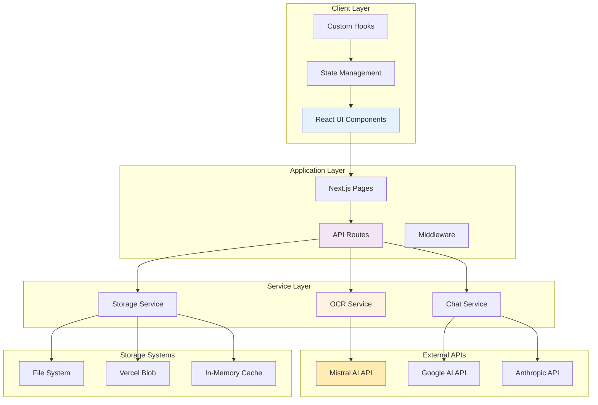

## 🔄 Детальные потоки данных

### Поток обработки PDF

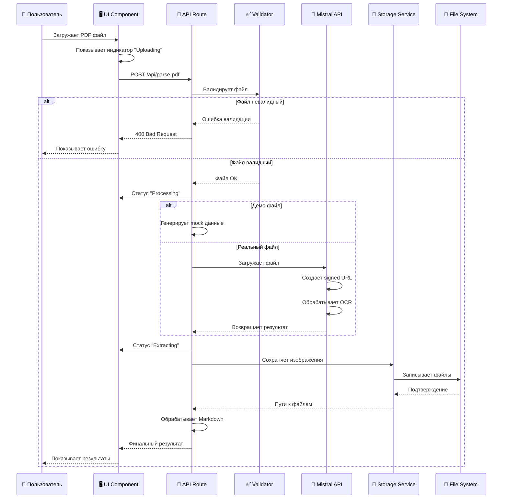

### Поток чата с документом

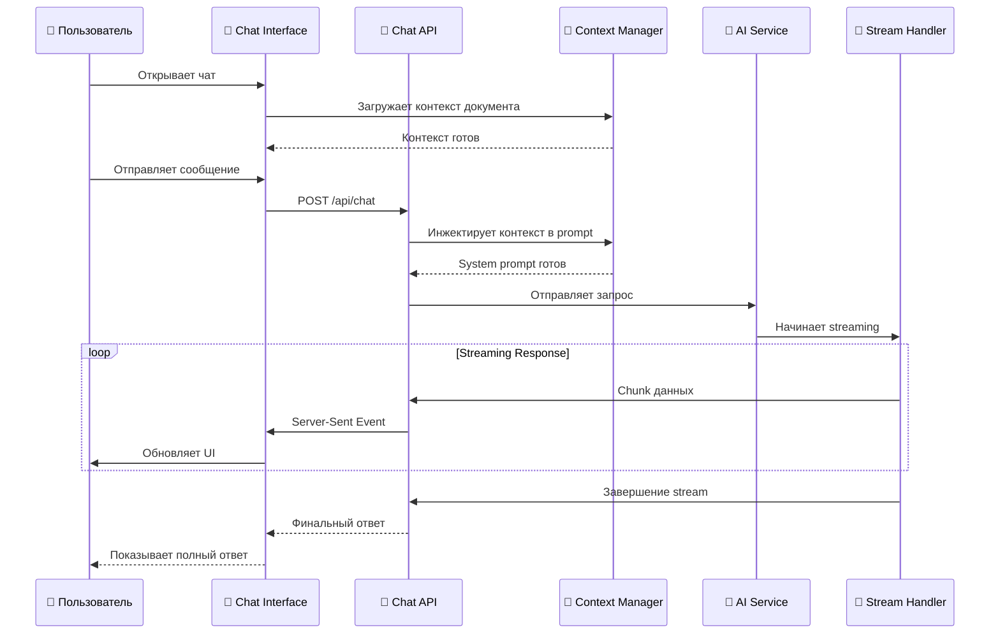

## 🏗️ Архитектура компонентов

### Иерархия React компонентов

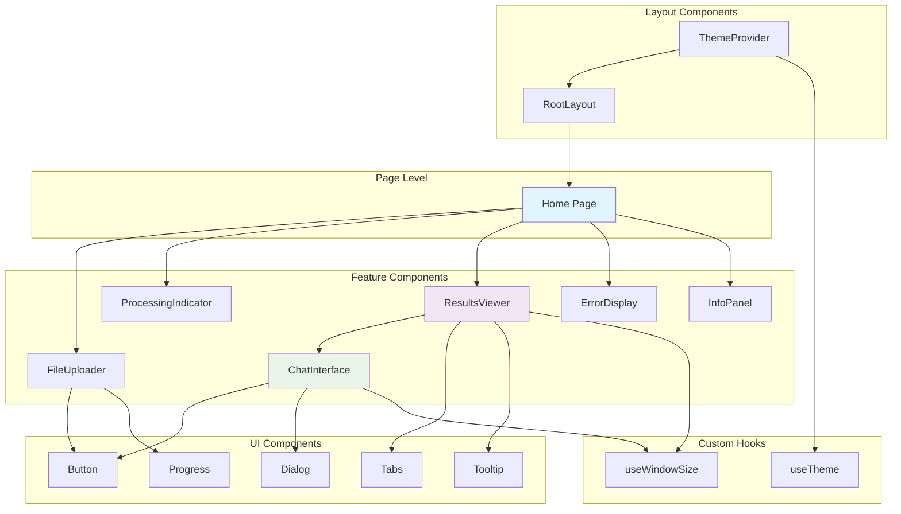

### Структура данных

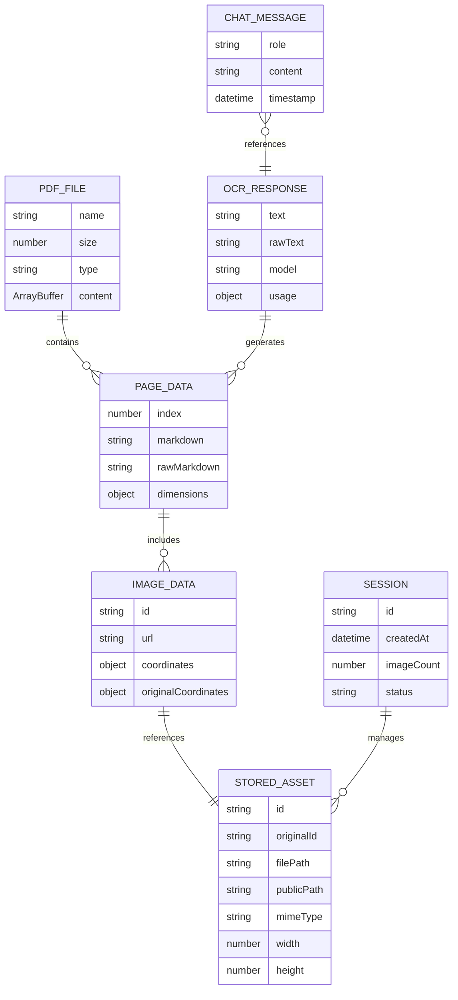

## 🔧 Архитектура сервисов

### OCR Service Architecture

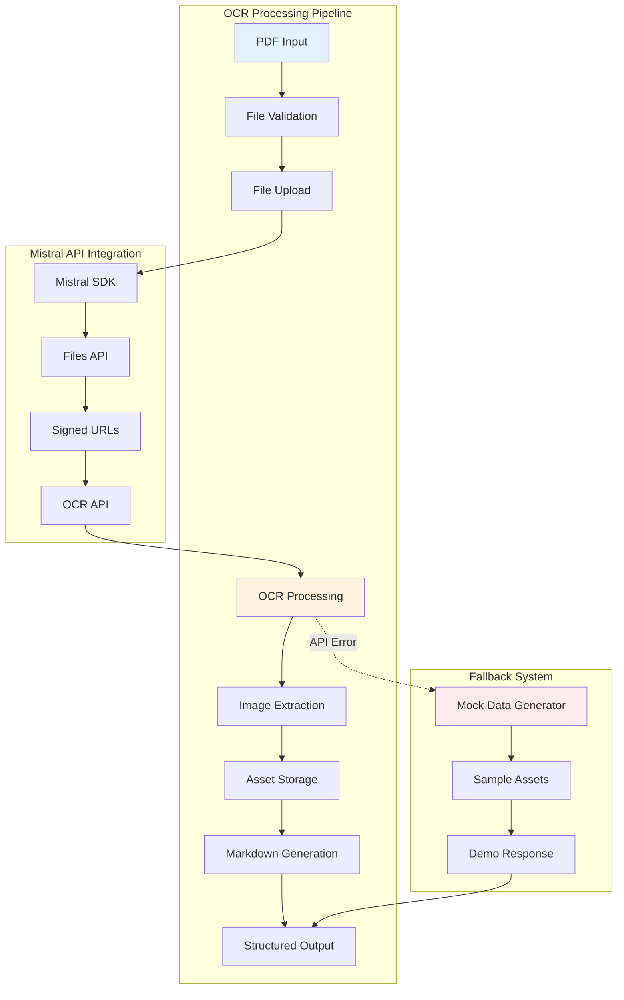

### Storage Service Architecture

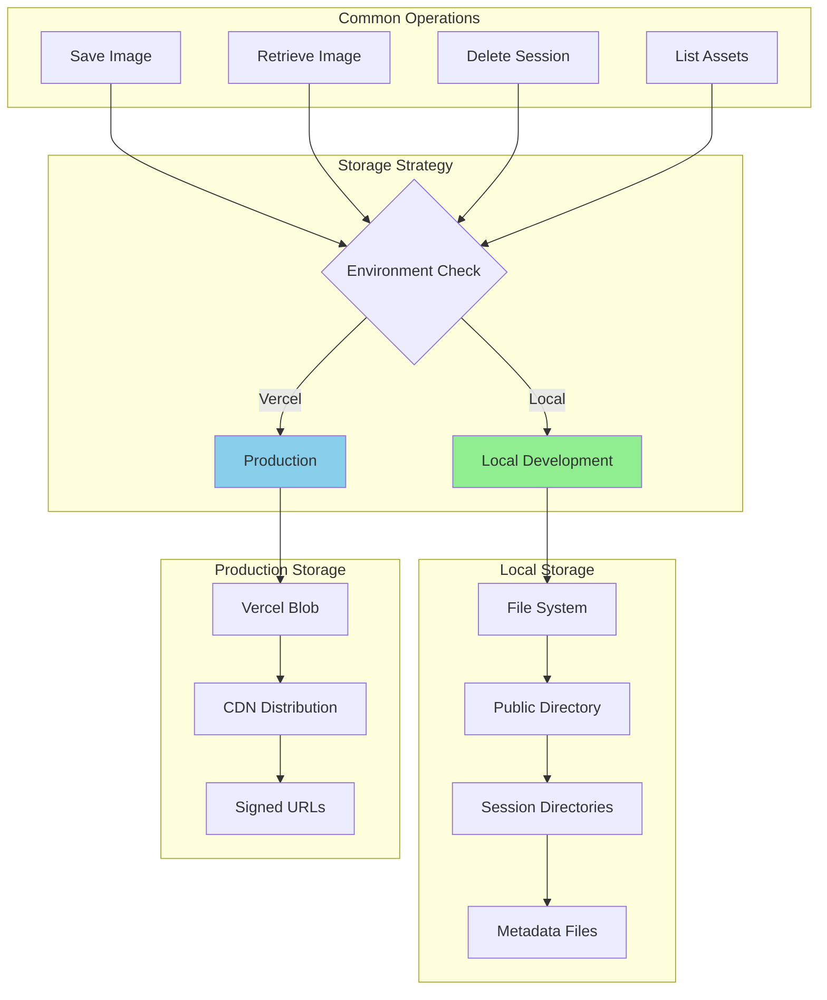

## 🌐 API Architecture

### API Routes Structure

```mermaid
graph TB
    subgraph "API Layer"
        ROUTES[API Routes]
        MIDDLEWARE[Middleware]
        HANDLERS[Route Handlers]
    end
    
    subgraph "PDF Processing"
        PDF_ROUTE[/api/parse-pdf]
        PDF_HANDLER[PDF Handler]
        PDF_VALIDATOR[PDF Validator]
        PDF_PROCESSOR[PDF Processor]
    end
    
    subgraph "Chat Processing"
        CHAT_ROUTE[/api/chat]
        CHAT_HANDLER[Chat Handler]
        CONTEXT_MANAGER[Context Manager]
        AI_CONNECTOR[AI Connector]
    end
    
    subgraph "External Integrations"
        MISTRAL_CLIENT[Mistral Client]
        GOOGLE_CLIENT[Google AI Client]
        ANTHROPIC_CLIENT[Anthropic Client]
    end
    
    ROUTES --> PDF_ROUTE
    ROUTES --> CHAT_ROUTE
    
    PDF_ROUTE --> PDF_HANDLER
    PDF_HANDLER --> PDF_VALIDATOR
    PDF_HANDLER --> PDF_PROCESSOR
    PDF_PROCESSOR --> MISTRAL_CLIENT
    
    CHAT_ROUTE --> CHAT_HANDLER
    CHAT_HANDLER --> CONTEXT_MANAGER
    CHAT_HANDLER --> AI_CONNECTOR
    AI_CONNECTOR --> GOOGLE_CLIENT
    AI_CONNECTOR --> ANTHROPIC_CLIENT
    
    style PDF_ROUTE fill:#f3e5f5
    style CHAT_ROUTE fill:#e8f5e8
```

### Request/Response Flow

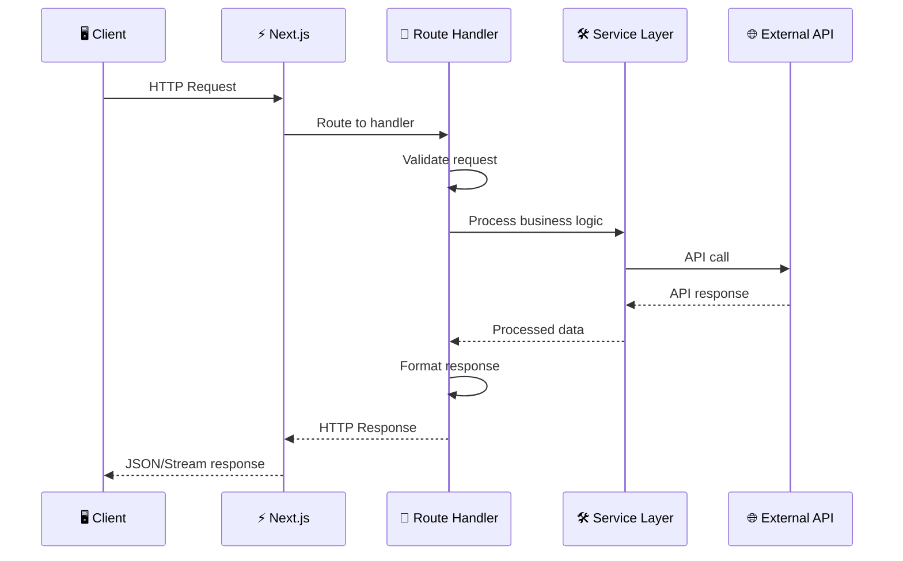

## 🎨 UI/UX Architecture

### Component State Management

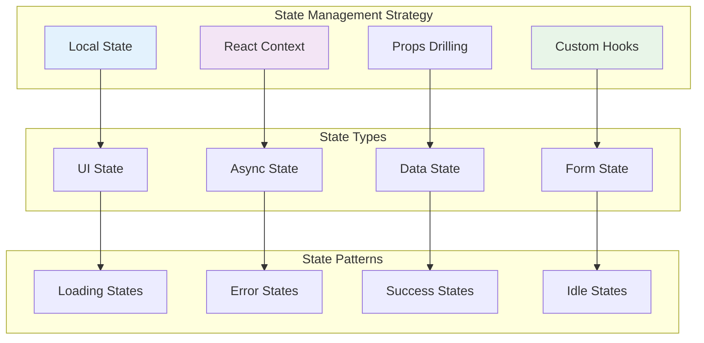

### Responsive Design Strategy

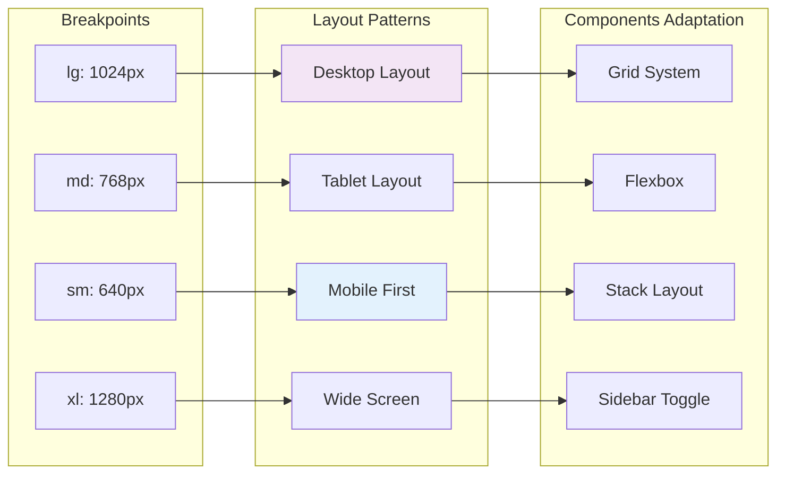

## 🔒 Security Architecture

### Security Layers

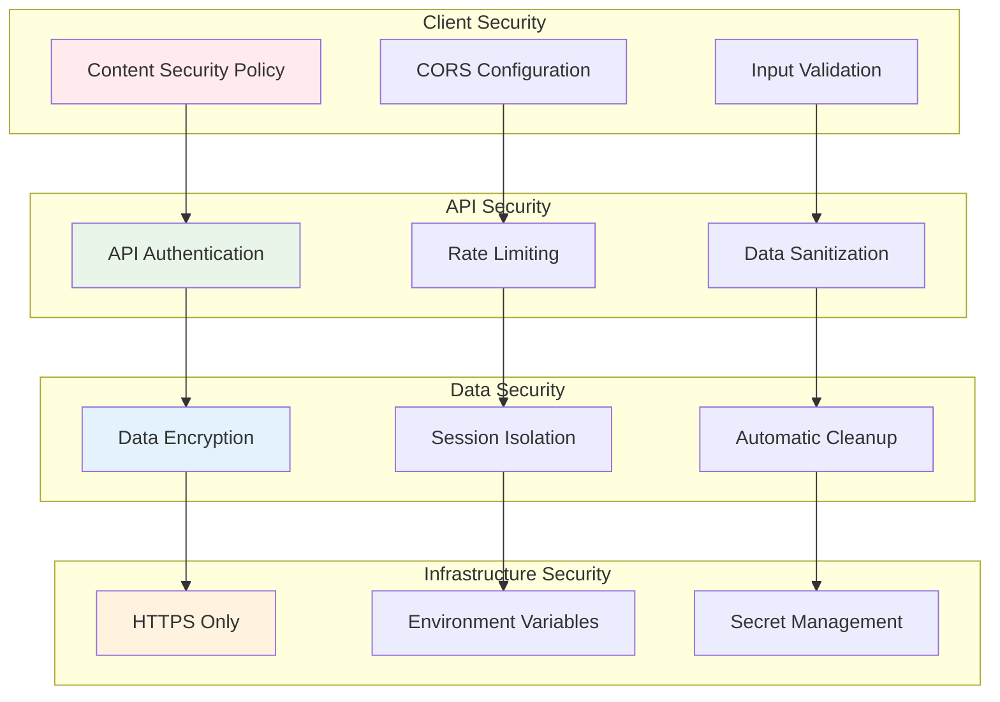

## 📊 Performance Architecture

### Performance Optimization Strategy

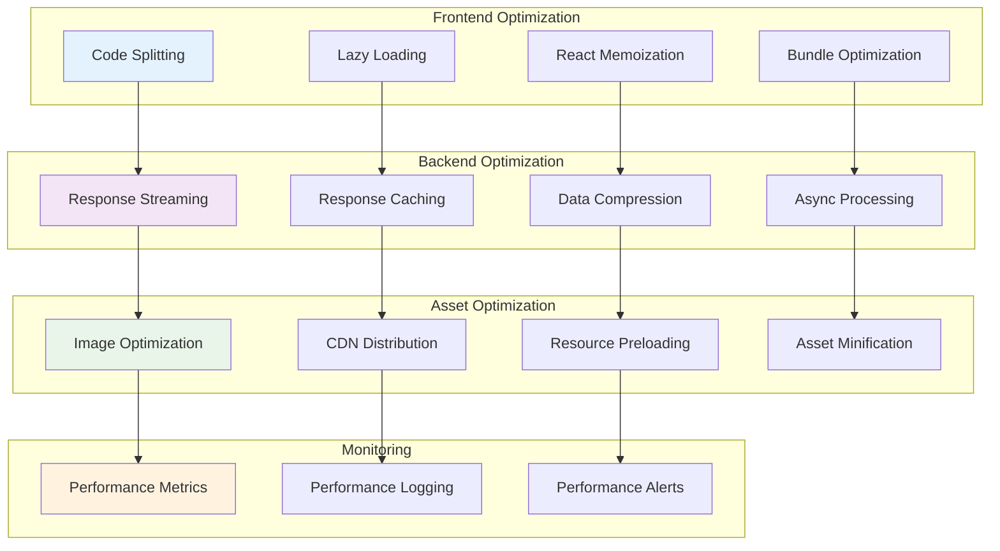

## 🚀 Deployment Architecture

### Deployment Strategy

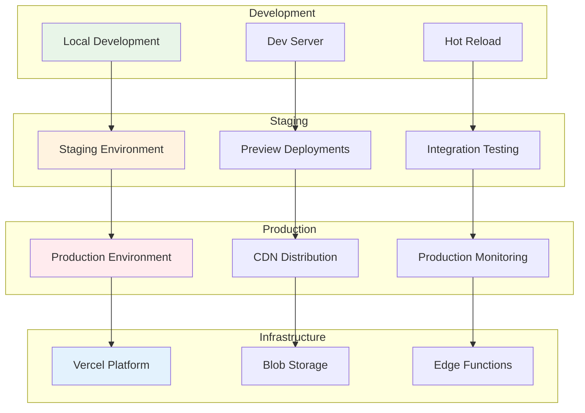

### CI/CD Pipeline

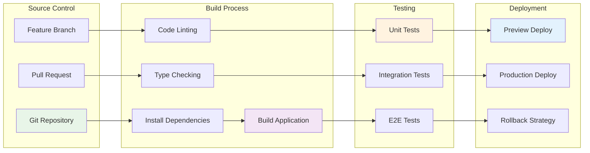

## 📈 Scalability Considerations

### Horizontal Scaling Strategy

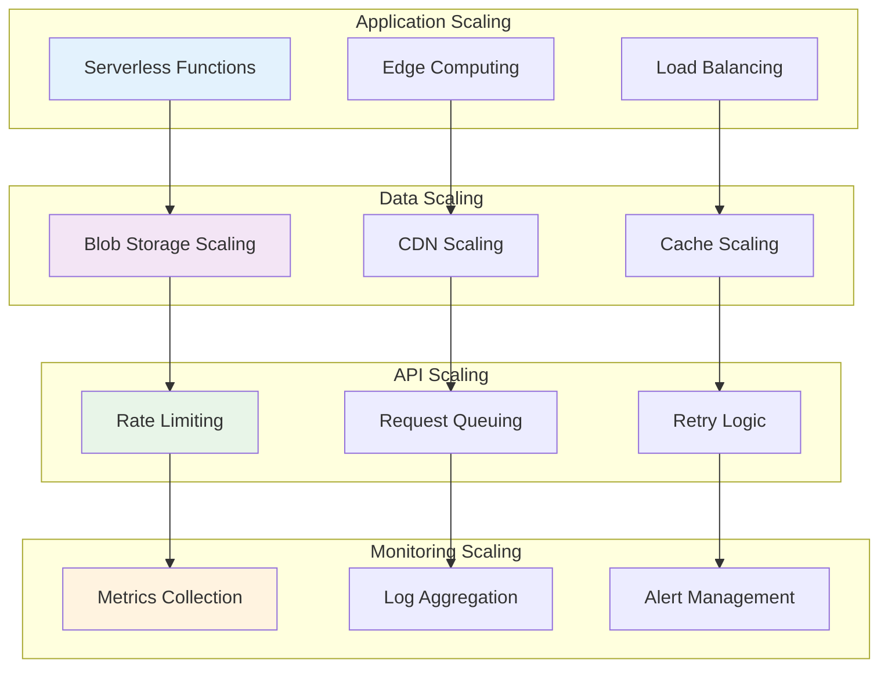

---

Эта архитектурная документация предоставляет полное понимание структуры и взаимодействий в системе Mistral OCR PDF Parser.
