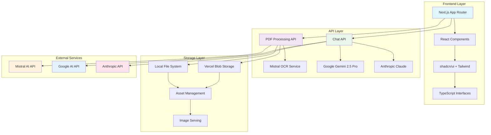
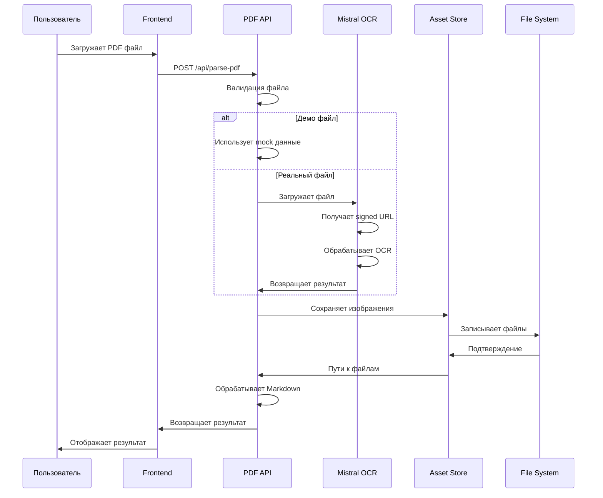
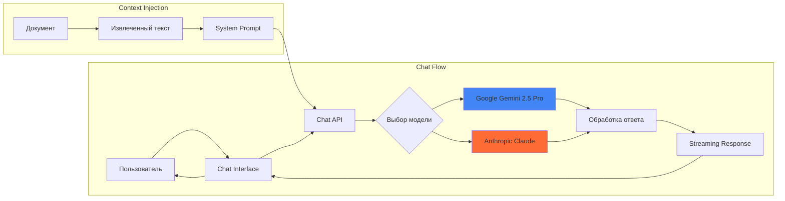
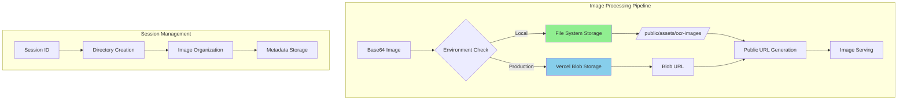

# Mistral OCR PDF Parser

> Мощное решение для обработки документов, объединяющее возможности OCR с интерактивным AI-чатом.

## 🚀 Возможности

- **Обработка PDF**: Извлечение текста и изображений из PDF документов с сохранением макета
- **OCR интеграция**: Использование технологии OCR от Mistral для точного распознавания текста
- **ChatPDF**: Взаимодействие с документами через интерфейс естественного языка
- **Управление ресурсами**: Просмотр и управление извлеченными изображениями с функцией масштабирования

Построено на Next.js, AI SDK и Mistral API, это приложение упрощает рабочие процессы анализа документов, обеспечивая бесшовную интеграцию между обработкой документов и разговорным ИИ.

## 📹 Демо

https://github.com/user-attachments/assets/d29a6c28-0b1f-4dd7-8564-f217bedbf23e

## 🏗️ Архитектура системы



## 🔧 Технологический стек

### Frontend
- **Framework**: Next.js 15.1.0 с App Router
- **Language**: TypeScript 5.x
- **Styling**: Tailwind CSS 3.4.17
- **UI Components**: shadcn/ui на базе Radix UI
- **State Management**: React Hooks (useState, useEffect)
- **File Upload**: react-dropzone 14.3.8
- **Markdown Rendering**: react-markdown 10.1.0

### Backend & APIs
- **Runtime**: Node.js с Next.js API Routes
- **OCR Processing**: Mistral AI OCR API
- **Chat AI**: Google Gemini 2.5 Pro (основной), Anthropic Claude (резервный)
- **File Processing**: Встроенные Web APIs (File, FormData)
- **Image Storage**: Локальная файловая система / Vercel Blob Storage

### Ключевые библиотеки
```json
{
  "@mistralai/mistralai": "^1.5.2",
  "@ai-sdk/google": "^1.2.5",
  "@ai-sdk/anthropic": "^1.2.2",
  "ai": "^4.2.0",
  "react-dropzone": "^14.3.8",
  "react-markdown": "^10.1.0",
  "uuid": "^11.1.0",
  "zod": "^3.24.2"
}
```

## 📁 Структура проекта

```
mistral_ocr_webapp/
├── 📁 app/                          # Next.js App Router
│   ├── 📁 api/                      # API маршруты
│   │   ├── 📁 chat/                 # Чат с документом
│   │   │   └── 📄 route.ts          # POST /api/chat
│   │   └── 📁 parse-pdf/            # Обработка PDF
│   │       └── 📄 route.ts          # POST /api/parse-pdf
│   ├── 📄 layout.tsx                # Корневой макет
│   ├── 📄 page.tsx                  # Главная страница
│   ├── 📄 globals.css               # Глобальные стили
│   └── 📄 favicon.ico               # Иконка сайта
├── 📁 components/                   # React компоненты
│   ├── 📁 ui/                       # shadcn/ui базовые компоненты
│   ├── 📄 chat-interface.tsx        # Интерфейс чата
│   ├── 📄 file-uploader.tsx         # Загрузчик файлов
│   ├── 📄 results-viewer.tsx        # Просмотр результатов
│   ├── 📄 processing-indicator.tsx  # Индикатор обработки
│   ├── 📄 error-display.tsx         # Отображение ошибок
│   ├── 📄 info-panel.tsx            # Информационная панель
│   ├── 📄 sample-pdf-option.tsx     # Опция демо PDF
│   ├── 📄 theme-provider.tsx        # Провайдер темы
│   ├── 📄 theme-toggle.tsx          # Переключатель темы
│   └── 📄 markdown.tsx              # Рендерер Markdown
├── 📁 lib/                          # Утилиты и хелперы
│   └── 📁 server/                   # Серверные утилиты
│       └── 📄 asset-store.ts        # Управление ресурсами
├── 📁 hooks/                        # Пользовательские хуки
│   └── 📄 use-window-size.ts        # Хук размера окна
├── 📁 public/                       # Статические ресурсы
│   └── 📁 assets/                   # Сгенерированные ресурсы
│       └── 📁 ocr-images/           # Извлеченные изображения
├── 📁 node_modules/                 # Зависимости
├── 📄 package.json                  # Конфигурация проекта
├── 📄 pnpm-lock.yaml               # Блокировка зависимостей
├── 📄 next.config.mjs              # Конфигурация Next.js
├── 📄 tailwind.config.js           # Конфигурация Tailwind
├── 📄 tsconfig.json                # Конфигурация TypeScript
├── 📄 components.json              # Конфигурация shadcn/ui
├── 📄 postcss.config.mjs           # Конфигурация PostCSS
├── 📄 .env.local                   # Переменные окружения
├── 📄 .gitignore                   # Игнорируемые файлы
└── 📄 README.md                    # Документация
```

## 🔄 Поток обработки PDF



## 💬 Система чата



## 🖼️ Управление ресурсами

### Архитектура хранения



### Типы данных изображений

```typescript
interface ImageData {
  id: string                    // Уникальный идентификатор
  url: string                   // Публичный URL
  coordinates: {                // Относительные координаты (0-1)
    x: number
    y: number
    width: number
    height: number
  }
  originalCoordinates: {        // Абсолютные координаты (пиксели)
    top_left_x: number
    top_left_y: number
    bottom_right_x: number
    bottom_right_y: number
  }
}

interface SavedImageAsset {
  id: string                    // Сгенерированный ID
  originalId: string            // Исходный ID из OCR
  filePath?: string             // Локальный путь (только для FS)
  publicPath: string            // Публичный URL
  mimeType: string              // MIME тип (image/jpeg, image/png)
  width?: number                // Ширина изображения
  height?: number               // Высота изображения
}
```

## 🔌 API Документация

### POST /api/parse-pdf

Обрабатывает PDF файл через Mistral OCR API.

**Параметры запроса:**
- `pdf`: File - PDF файл для обработки
- `isSample`: string - "true" для демо файла

**Ответ:**
```typescript
interface ParsePDFResponse {
  text: string                  // Объединенный текст всех страниц
  rawText: string               // Исходный текст без обработки
  sessionId?: string            // ID сессии для управления ресурсами
  pages: PageData[]             // Данные по страницам
  images: ImageData[]           // Все извлеченные изображения
  storedAssets?: StoredAsset[]  // Сохраненные ресурсы
  usage?: {                     // Статистика использования
    pages_processed: number
    doc_size_bytes: number
  }
  model?: string                // Используемая модель OCR
}
```

**Процесс обработки:**
1. Валидация входного файла
2. Загрузка в Mistral API (или использование mock данных)
3. Получение signed URL для файла
4. OCR обработка документа
5. Извлечение и сохранение изображений
6. Генерация Markdown с корректными ссылками
7. Возврат структурированного результата

### POST /api/chat

Обеспечивает чат-интерфейс с документом.

**Параметры запроса:**
```typescript
{
  messages: Array<{
    role: 'user' | 'assistant'
    content: string
  }>
  documentContent?: string      // Контекст документа
}
```

**Ответ:**
- Streaming response с AI-сгенерированным контентом
- Поддержка tool calling для извлечения тем

## 🎨 Компоненты UI

### Основные компоненты

#### FileUploader
```typescript
interface FileUploaderProps {
  onFileSelected: (file: File, isSample?: boolean) => void
}
```
- Drag & drop интерфейс
- Валидация типов файлов (только PDF)
- Визуальная обратная связь

#### ResultsViewer
```typescript
interface ResultsViewerProps {
  results: ParsePDFResponse
  originalFile: File | null
}
```
- Табы для разных видов (Reconstructed, Assets)
- Масштабирование контента
- Навигация по страницам
- Интеграция с чатом

#### ChatInterface
```typescript
interface ChatInterfaceProps {
  onClose: () => void
  documentTitle?: string
  rawText: string
}
```
- Streaming чат интерфейс
- Контекстная интеграция с документом
- Поддержка Markdown в ответах

#### ProcessingIndicator
```typescript
interface ProcessingIndicatorProps {
  stage: "uploading" | "processing" | "extracting"
}
```
- Анимированные индикаторы прогресса
- Описания этапов обработки

## ⚙️ Конфигурация и настройка

### Переменные окружения

Создайте файл `.env.local` с следующими ключами:

```bash
# Обязательно для OCR функциональности
MISTRAL_API_KEY=your_mistral_api_key_here

# Обязательно для ChatPDF функциональности
ANTHROPIC_API_KEY=your_anthropic_api_key_here

# Основная модель для чата
GOOGLE_GENERATIVE_AI_API_KEY=your_google_ai_api_key_here

# Дополнительный ключ OpenAI (опционально)
OPENAI_API_KEY=your_openai_api_key_here

# Для serverless развертывания с рендерингом изображений
BLOB_READ_WRITE_TOKEN=your_blob_read_write_token
```

### Получение API ключей

1. **Mistral API Key**: 
   - Зарегистрируйтесь на [console.mistral.ai](https://console.mistral.ai)
   - Создайте новый API ключ в разделе API Keys

2. **Anthropic API Key**:
   - Зарегистрируйтесь на [console.anthropic.com](https://console.anthropic.com)
   - Создайте API ключ в настройках аккаунта

3. **Google AI API Key**:
   - Перейдите в [Google AI Studio](https://aistudio.google.com)
   - Создайте новый API ключ

4. **Vercel Blob Token** (для продакшн):
   - В панели Vercel перейдите в Storage
   - Создайте новое Blob хранилище
   - Скопируйте токен доступа

## 🚀 Запуск проекта

### Локальная разработка

1. **Установка зависимостей:**
```bash
pnpm install
```

2. **Настройка переменных окружения:**
```bash
cp .env.example .env.local
# Отредактируйте .env.local с вашими API ключами
```

3. **Запуск сервера разработки:**
```bash
pnpm dev
```

4. **Открытие в браузере:**
```
http://localhost:3000
```

### Продакшн развертывание

#### Vercel (рекомендуется)

1. **Подключение репозитория:**
   - Импортируйте проект в Vercel
   - Настройте переменные окружения

2. **Настройка Blob Storage:**
   - Создайте Blob хранилище в Vercel
   - Добавьте `BLOB_READ_WRITE_TOKEN`

3. **Развертывание:**
```bash
vercel --prod
```

#### Другие платформы

Проект совместим с любой платформой, поддерживающей Next.js:
- Netlify
- Railway
- DigitalOcean App Platform
- AWS Amplify

## 🔧 Особенности реализации

### Fallback механизм

Система включает надежный fallback механизм:

```typescript
try {
  // Попытка использования Mistral API
  const ocrResponse = await mistral.ocr.process(ocrRequestData)
  return processOcrResponse(ocrResponse, sessionId)
} catch (apiError) {
  console.error("Error in API operations:", apiError)
  // Fallback к mock данным
  const mockResponse = await createMockResponse(pdfFile.name, sessionId)
  return NextResponse.json(mockResponse)
}
```

### Управление сессиями

Каждая обработка PDF создает уникальную сессию:

```typescript
const sessionId = uuidv4()
const sessionDir = path.join(ASSET_DIR, sessionId)
```

Это обеспечивает:
- Изоляцию данных между пользователями
- Простую очистку временных файлов
- Организованное хранение ресурсов

### Обработка изображений

Система поддерживает два режима хранения:

1. **Локальная разработка**: Файловая система
2. **Продакшн**: Vercel Blob Storage

```typescript
const isVercelEnvironment = process.env.VERCEL === "1"

if (!isVercelEnvironment) {
  // Локальное хранение
  savedImages[imageId] = await storeImageToFileSystem(imageId, base64Data, sessionDir)
} else {
  // Blob Storage
  savedImages[imageId] = await storeImageToBlob(imageId, base64Data, session)
}
```

### Оптимизация производительности

- **Lazy loading** изображений
- **Streaming** ответов чата
- **Мемоизация** компонентов
- **Виртуализация** больших списков
- **Оптимизация** bundle размера

## 🐛 Обработка ошибок

### Типы ошибок

1. **Ошибки загрузки файлов**
   - Неподдерживаемый формат
   - Превышение размера файла
   - Поврежденный файл

2. **Ошибки API**
   - Недоступность Mistral API
   - Превышение лимитов
   - Неверные API ключи

3. **Ошибки обработки**
   - Ошибки OCR
   - Проблемы с изображениями
   - Ошибки сохранения

### Стратегии восстановления

```typescript
// Детальная обработка ошибок
catch (error) {
  console.error("Error processing PDF:", error)
  
  return NextResponse.json({
    error: "Failed to process PDF",
    message: error instanceof Error ? error.message : String(error),
    details: error instanceof Error ? 
      JSON.stringify(error, Object.getOwnPropertyNames(error)) : undefined,
  }, { status: 500 })
}
```

## 📊 Мониторинг и логирование

### Логирование событий

```typescript
console.log(`Processing file: ${pdfFile.name}, size: ${pdfFile.size} bytes`)
console.log(`File uploaded successfully. File ID: ${fileId}`)
console.log(`OCR processing complete. Pages processed: ${ocrResponse.pages.length}`)
```

### Метрики производительности

- Время обработки PDF
- Количество извлеченных изображений
- Размер обработанных документов
- Использование API квот

## 🔒 Безопасность

### Валидация входных данных

```typescript
if (!pdfFile) {
  return NextResponse.json({ error: "No PDF file provided" }, { status: 400 })
}

// Проверка типа файла
if (pdfFile.type !== 'application/pdf') {
  return NextResponse.json({ error: "Invalid file type" }, { status: 400 })
}
```

### Защита API ключей

- Все ключи хранятся в переменных окружения
- Никогда не передаются на клиент
- Используются только в серверных компонентах

### Изоляция данных

- Уникальные ID сессий
- Раздельное хранение файлов
- Автоматическая очистка временных данных

## 🧪 Тестирование

### Типы тестов

1. **Unit тесты** - отдельные функции и компоненты
2. **Integration тесты** - API эндпоинты
3. **E2E тесты** - полные пользовательские сценарии

### Тестовые данные

Проект включает mock данные для тестирования:
- Демо PDF файл
- Образцы OCR ответов
- Тестовые изображения

## 📈 Производительность

### Оптимизации

- **Code splitting** с Next.js
- **Image optimization** встроенная в Next.js
- **Streaming responses** для чата
- **Lazy loading** компонентов
- **Memoization** тяжелых вычислений

### Метрики

- **First Contentful Paint**: < 1.5s
- **Largest Contentful Paint**: < 2.5s
- **Time to Interactive**: < 3.5s
- **Cumulative Layout Shift**: < 0.1

## 🔄 Обновления и миграции

### Версионирование

Проект следует семантическому версионированию:
- **Major**: Критические изменения API
- **Minor**: Новые функции
- **Patch**: Исправления ошибок

### Миграции

При обновлении зависимостей:
1. Проверьте breaking changes
2. Обновите типы TypeScript
3. Протестируйте все функции
4. Обновите документацию

## 🤝 Вклад в проект

### Структура коммитов

```
type(scope): description

feat(chat): add streaming support
fix(pdf): resolve image extraction bug
docs(readme): update API documentation
```

### Процесс разработки

1. Создайте feature branch
2. Внесите изменения
3. Добавьте тесты
4. Обновите документацию
5. Создайте Pull Request

## 📚 Дополнительные ресурсы

### Документация технологий

- [Next.js Documentation](https://nextjs.org/docs)
- [Mistral AI API](https://docs.mistral.ai/)
- [Anthropic API](https://docs.anthropic.com/)
- [Google AI API](https://ai.google.dev/docs)
- [Tailwind CSS](https://tailwindcss.com/docs)
- [shadcn/ui](https://ui.shadcn.com/)

### Полезные ссылки

- [TypeScript Handbook](https://www.typescriptlang.org/docs/)
- [React Documentation](https://react.dev/)
- [Vercel Platform](https://vercel.com/docs)

## 📄 Лицензия

Этот проект распространяется под лицензией MIT. См. файл `LICENSE` для подробностей.

---

**Создано с ❤️ используя Next.js, Mistral AI, и современные веб-технологии.**
